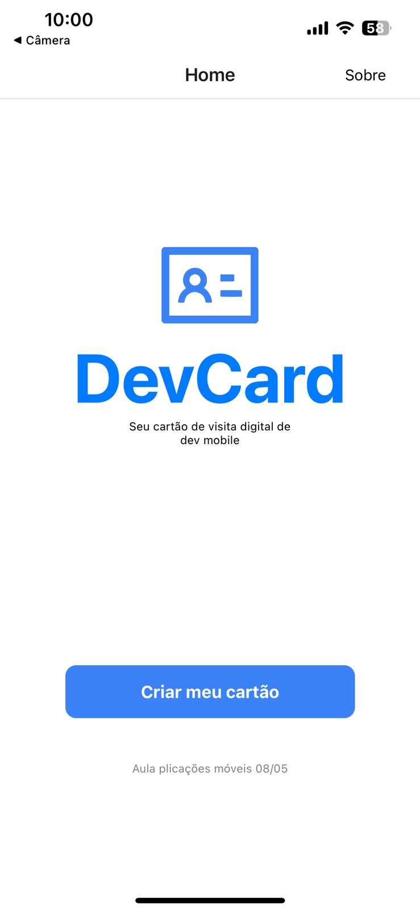
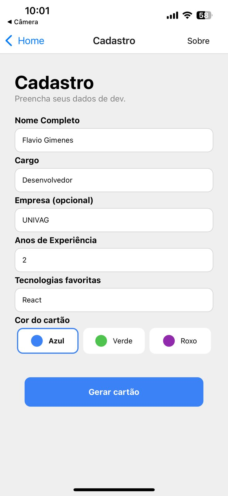
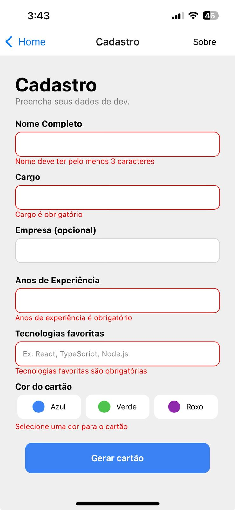
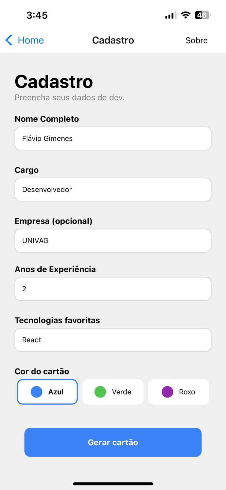
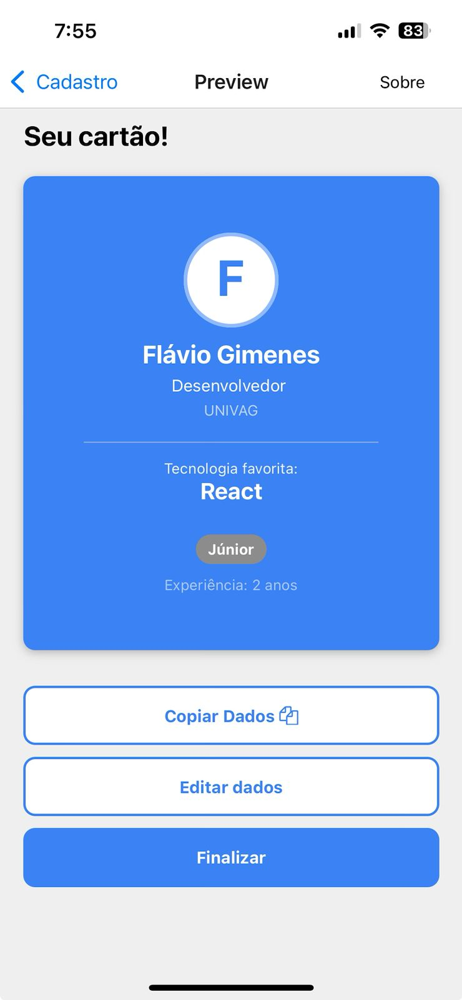
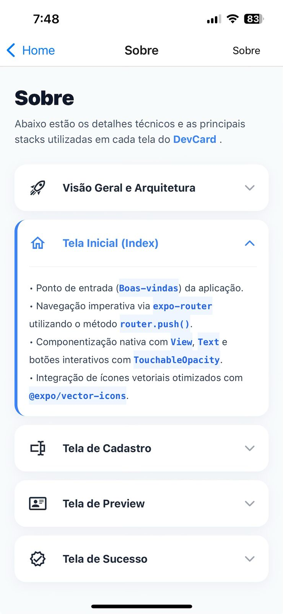

# DevCard - Atividade Prática - Aplicações Móveis
### 1. Home (Página Inicial)

A porta de entrada do **DevCard**, focada em oferecer uma experiência simples e direta ao usuário.

* **Identidade:** Apresenta o logótipo e o nome da aplicação de forma centralizada.
* **Proposta de Valor:** Uma breve descrição que posiciona o app como uma ferramenta para criar cartões de visita digitais para desenvolvedores mobile.
* **Ação Principal:** Botão interativo que encaminha o utilizador para o fluxo de cadastro via `expo-router`.
* **Rodapé:** Identificação da aula e contexto de desenvolvimento.

---

### 2. Cadastro de Perfil
Nesta tela, o utilizador fornece os dados técnicos e pessoais para a geração do seu cartão digital. O formulário conta com lógica de validação robusta para garantir a integridade dos dados.

- **Elementos de Entrada:**
  - Campo de texto para **Nome Completo**
  - Campo de texto para **Cargo**
  - Campo de texto para **Empresa**
  - Campo numérico para **Anos de Experiência**
  - Campo de texto para **Tecnologia Favorita**
  - Seletor de estilo (Control/Botões) para escolha da **Cor do cartão**.

**Destaques Técnicos:**
- **Validação em Tempo Real:** O campo "Anos de Experiência" aceita apenas números e valida valores negativos.
- **Tratamento de Erros:** Exibe mensagens específicas por campo e um alerta de "Erro Geral" caso requisitos mínimos não sejam atendidos ao tentar submeter.
- **Seleção Dinâmica:** Botões de cores interativos que permitem personalizar a estética do cartão final.
- **Acessibilidade e UX:** Uso de `KeyboardAvoidingView` para evitar que o teclado oculte os inputs e `ScrollView` para garantir usabilidade em dispositivos menores.

#### Estados da Interface:

  
  
  

* **1 - Estado Inicial:** Campos limpos e placeholders indicativos.
* **2 - Estado de Erro:** Feedbacks visuais em vermelho destacando campos obrigatórios ou formatos inválidos.
* **3 - Formulário Preenchido:** Dados validados e seleção de cor ativa, pronto para a geração do preview.

---
### 3. Visualização do Cartão (Preview)

Esta tela renderiza dinamicamente o cartão de visita digital com base nos dados recebidos, transformando informações brutas em uma interface visual elegante.

**Destaques Técnicos:**
- **Lógica de Senioridade:** O sistema calcula automaticamente o nível do desenvolvedor (**Júnior, Pleno ou Sênior**) com base nos anos de experiência e altera a cor da etiqueta de nível (ex: Dourado para Sênior).
- **Estilização Dinâmica:** O fundo do cartão e os elementos visuais adaptam-se à cor selecionada pelo utilizador no passo anterior.
- **Manipulação de Strings:** O app extrai automaticamente a inicial do nome para o ícone de perfil e destaca a primeira tecnologia da lista como "Tecnologia Principal".
- **Fluxo de Navegação:** Implementa a opção de retorno para edição (`router.back()`) ou finalização do fluxo.

---

### 4. Conclusão (Sucesso)

A tela final que confirma a criação do cartão e oferece opções para reiniciar o fluxo ou retornar ao início.

**Destaques Técnicos:**
- **Feedback Visual Positivo:** Utiliza elementos visuais (emoji/imagem) e mensagens claras para confirmar que a operação foi realizada com êxito.
- **Gerenciamento de Navegação:** Utiliza o `router.replace('/')` no botão de novo cartão, garantindo que o histórico de navegação anterior seja resetado, impedindo que o usuário volte acidentalmente para os dados do cartão já finalizado.
- **UX (Experiência do Usuário):** Fornece uma saída clara para o fluxo, permitindo que o usuário escolha entre criar um novo perfil ou apenas voltar à tela inicial.

---

### 5. Documentação Técnica (Sobre)

Uma tela dedicada a detalhar a arquitetura do projeto e as tecnologias aplicadas em cada etapa do desenvolvimento. Mais do que uma página informativa, é um exemplo de UI interativa e dinâmica.

**Destaques Técnicos:**
- **Componente Accordion (Colapsável):** Implementação de uma lista de tópicos que se expandem e contraem, otimizando o espaço da tela e melhorando a legibilidade.
- **LayoutAnimation:** Uso da API nativa `LayoutAnimation` para criar transições suaves e fluidas entre os estados aberto/fechado dos cards, garantindo uma sensação de "app premium".
- **Renderização Condicional de Texto:** Sistema inteligente que identifica palavras entre crases (ex: `React Native`) no código e as estiliza de forma diferenciada, simulando um realce de sintaxe de código.
- **Arquitetura de Dados:** Centralização das informações em um objeto de configuração (`topicosTecnicos`), facilitando a manutenção e escalabilidade do conteúdo.